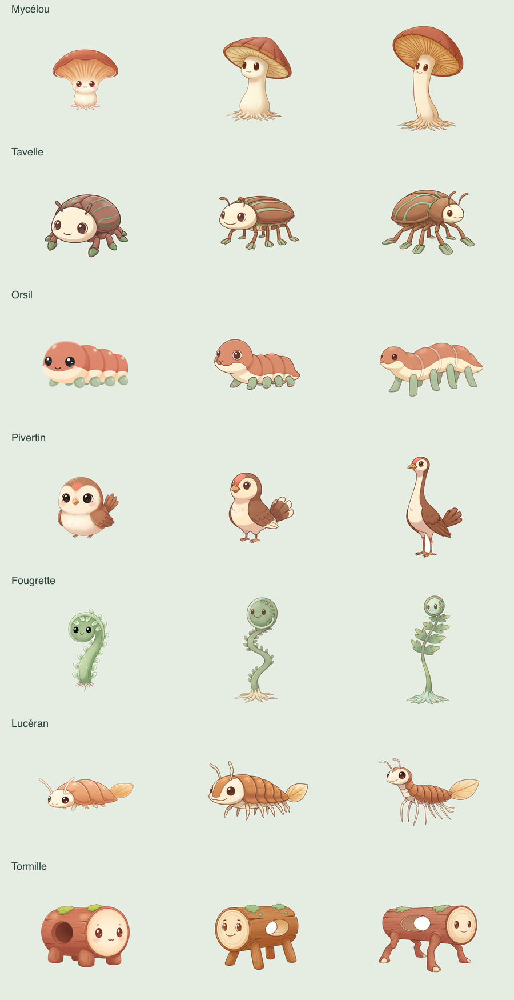
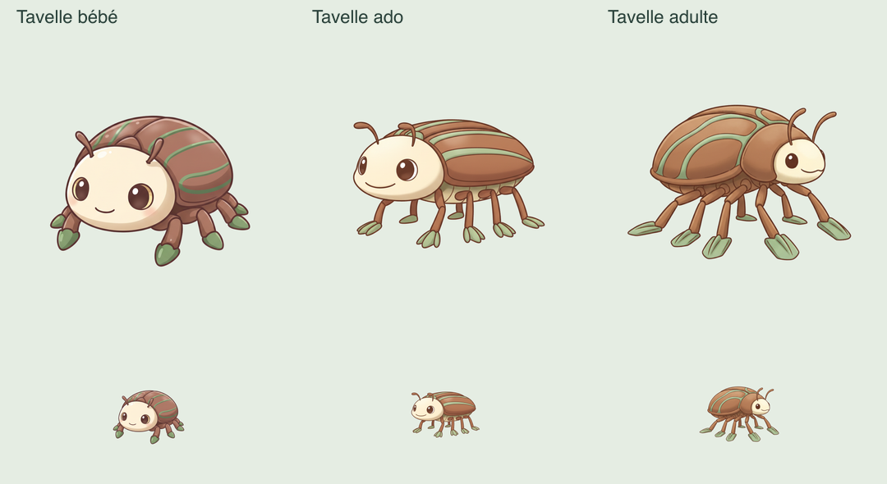

# Monde 0 — trois âges terminés, seul le visage adulte de Tavelle à corriger

La reprise utilisateur `--renewal-0-growth-resume` est terminée, résultat `renewal/0/b0279d02-1e82-4539-b2f4-1f03945a25d3-result.json`. Huit évolutions générées, treize images réutilisées, 21 inspections : **20 positives, un refus ; `fullValidation:false`, aucune publication ni écriture de base.** Appels 239–267 ; **267 appels / 17,95 € réservés / plafond cumulé autorisé 40 €.** Les corrections locales de détourage de Lucéran et Orsil restent exactes.

Le retour **« ok c’est bon pour moi »**, reçu après cette passe, est conservé dans `renewal/0/growth-visual-review.json` comme avis favorable sur le lot. Il ne remplace pas la QA : seul l’adulte de Tavelle doit être corrigé. Les vingt autres images restent conservées.



## Refus exact et revue

Tavelle adulte (`slot:1`, `stage:3`) : identité, croissance, habitat et originalité vrais ; texte absent, sécurité 0. Seul **`faceReadable:false`** entraîne `styleScore:0`, puis `style_coherence`. La comparaison locale aux trois âges, incluant des portraits réels de 128 px, montre un visage adulte de profil avec un seul œil visible et une petite surface crème. Le bébé et l’ado passent leurs contrôles. Aucun autre refus dans le groupe.



## Correction préparée

`renewal/0/face-repair-plan.json` est lié par empreintes au résultat, brouillon, marqueur, trace, avis visuel et aux 21 PNG exacts. Le chargeur revérifie aussi la recette des bébés, la récupération des adultes, le catalogue et les accords du pilote.

Une seule image est demandée, à partir de l’adulte actuel comme unique référence : conserver son corps développé, la carapace châtaigne à rainures sauge et les six pattes à palettes ; tourner la tête vers le spectateur, montrer deux yeux distincts et la bouche, élargir légèrement la face crème pour la rendre lisible à 128 px. Éviter toute régression aux proportions du bébé ou de l’ado. Aucun cadre, panneau intérieur ou ombre de sol demandé. Les vingt autres PNG sont réutilisés exactement ; tous les originaux restent conservés. Aucun changement des seuils de détourage ou de QA.

Les trois âges de Tavelle sont inspectés d’abord, avec les deux autres âges et une véritable vignette 128 px. Les dix-huit inspections des autres créatures ne commencent que si cette lignée passe. Le groupe complet reste soumis aux 21 contrôles visage/identité/croissance/habitat/originalité/style/texte/sécurité, sur les vrais arts finaux et le catalogue/pilote historique.

## Commande suivante

Dans `app/`, Terminal utilisateur sous Node 22 :

```sh
node --conditions=react-server --import tsx scripts/worldgen-pilot.ts --renewal-0-face-repair
```

Plan réel `--renewal-0-face-repair-plan` vérifié sans API : **une image + 21 inspections maximum, vingt arts conservés, 1,15 € supplémentaires, cumul prévu 19,10 € sur 40 €.** Si la lignée prioritaire échoue : une image + trois inspections, 0,25 € supplémentaires / cumul 18,20 €. Le budget complet est exigé avant départ. Prévision globale avec le socle 0–5 : **36,10 €**, hors autres corrections/finalisation payante.

Marqueur distinct `renewal/0/face-repair-started.json`, nouveaux brouillons/diagnostics/bilan, galerie progressive `preview-renewal-0-face-repair-<run>.html`. Ne pas relancer les anciennes passes, ne supprimer aucun marqueur. Même journal/verrou, réservations avant HTTP, aucune relance ou publication automatique. Les deux bases restent ouvertes en lecture seule. L’accès Gemini de l’agent demeure bloqué, aucune tentative réelle ni contournement ici ; la commande payante reste à exécuter par l’utilisateur.

## Vérification

20 tests ciblés distincts passent : parcours bébé/récupération/reprise, une seule correction avec référence adulte, conservation exacte des vingt arts et de tous les anciens fichiers, QA prioritaire, arrêt après refus, budget complet, source modifiée et seconde exécution bloqués. Typage, lint et format passent ; plan réel sans API et préservation familiale vérifiés : **26 tables identiques, intégrité ok**.

Aucun nouveau dessin réel produit dans ce tour. Aucun seed/migration/remplacement/restauration, serveur ou nouvel essai familial/WebGL. Sessions, possessions, surnoms, stades, reçus, Teddy et recalibrage préservés. Prochaine suite : terminer Tavelle → bébés des autres mondes autorisés → évolutions → intégration du pilote → stabilisation et mise en service familiale. Les anciens tests, la couverture globale et l’ancien canari attendent toujours la stabilisation.
