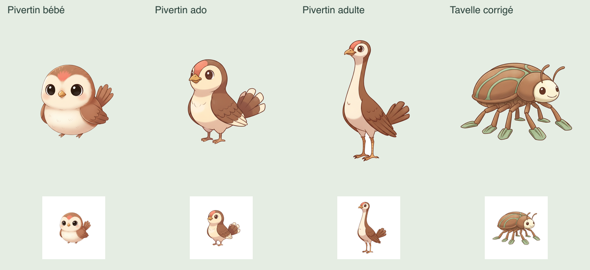

# Monde 0 — Tavelle validé, Pivertin adulte à corriger

La première correction de visage est terminée : `renewal/0/e596f313-b123-4e95-ad29-3dbffb8b8a81-result.json`. Une image produite, vingt conservées, 21 inspections. **Tavelle passe aux trois âges ; 20/21 QA positives.** Seul Pivertin adulte est désormais refusé, `faceReadable:false`, d’où `style_coherence`. Identité, croissance, habitat, originalité vrais ; texte vide, sécurité 0. Le groupe n’est pas publié et `fullValidation:false` reste conservé.

Retour utilisateur **« ok c’est bon »** : avis favorable enregistré dans `renewal/0/face-repair-2-review.json`, en conservant Tavelle corrigé et les autres arts positifs. Nouveau Tavelle exact : `world/0/runtime-29395aaf-e59d-41a8-aa33-a3c6e3c4e9a0-creature-1-adulte.png`. **289 appels / 19,10 € réservés / plafond cumulé 40 € déjà autorisé.**

## Pourquoi ce nouveau refus

Pivertin adulte est exactement le même PNG qu’à la passe précédente : SHA-256 `3932c6770a555210997db29fdb73b0d1e9cfe2621ae9812192333e43c061cda3`. Comparaison des requêtes 258 et 280 : cible, bébé, ado et vignette 128 px identiques. Les anciennes références n’ont pas été échangées ; une planche de pairs change avec Tavelle. Le modèle a pourtant changé `faceReadable:true` en `false`. Ce n’est pas une nouvelle dégradation des pixels.

La revue à 128 px confirme une petite tête entièrement de profil avec un seul œil visible. Le contrôle actuel exige explicitement deux yeux expressifs et une bouche reconnaissables à cette taille. Le précédent résultat positif ne suffit donc pas à lever le refus. Aucun mélange opportuniste des anciens et nouveaux verdicts, aucun seuil abaissé ni nouvelle inspection répétée jusqu’à obtenir un succès.



## Correction préparée

La nouvelle passe ne change que Pivertin adulte. Référence unique : son adulte actuel. Conserver le long cou, le corps développé, le plumage châtaigne/crème, les deux ailes repliées, l’éventail de queue et les deux pattes. Tourner la tête vers le spectateur, élargir légèrement le visage, montrer les deux yeux et un petit bec souriant bien lisibles à 128 px. La tête reste proportionnellement plus petite que chez bébé/ado. Aucun décor, cadre ou accessoire demandé. Les vingt autres PNG, dont Tavelle corrigé, sont conservés exactement.

`renewal/0/face-repair-2-plan.json` lie par empreintes l’avis, le résultat, le brouillon, la trace et les 21 arts de la première correction. Elle reste liée à la première recette et à la récupération précédente. Le chargeur exige que la première correction ait changé seulement son adulte cible, puis que le nouveau refus concerne une autre créature. Il contrôle aussi l’ordre des trois inspections prioritaires et les références réelles de la première édition. Deux passes explicites maximum dans ce parcours ; aucune boucle automatique, aucune recette historique réécrite.

## Commande suivante

Dans `app/`, Terminal utilisateur sous Node 22 :

```sh
node --conditions=react-server --import tsx scripts/worldgen-pilot.ts --renewal-0-face-repair-2
```

Plan réel `--renewal-0-face-repair-2-plan` vérifié sans API : **une image, vingt réutilisées, trois inspections de Pivertin d’abord, puis dix-huit autres uniquement si sa lignée passe. Maximum 1,15 € supplémentaires / cumul prévu 20,25 € sur 40 €.** Si la lignée prioritaire échoue : 0,25 € supplémentaires / cumul 19,35 €. Prévision globale du socle 0–5 : **37,25 €**, hors autres corrections/finalisation payante.

Nouveau marqueur `face-repair-2-started.json`, nouveaux brouillons/diagnostics/bilan, galerie `preview-renewal-0-face-repair-2-<run>.html`. Ne relancer ni `--renewal-0-face-repair`, ni les générations antérieures ; conserver les deux marqueurs et toutes les réservations. Même verrou/journal, garde complète avant chaque appel, aucune publication, deux bases en lecture seule. Gemini reste bloqué pour l’agent ; aucun nouvel appel réel ni contournement.

## Vérification

22 tests ciblés distincts passent : parcours existants, seconde correction liée à la première, conservation exacte de Tavelle et des autres images, mauvais lien source refusé avant API, contrôle de Pivertin prioritaire, arrêt après nouveau refus, budget et verrou de seconde exécution. Un test complet dépassait légèrement la limite de 5 secondes ; son délai local a été aligné à 15 secondes sur les autres tests enchaînant plusieurs passes, sans retirer aucune assertion. Typage/lint/format et plan réel passent. Préservation familiale vérifiée : **26 tables identiques, intégrité ok**.

Aucun nouveau dessin réel produit ici. Aucun seed, migration, remplacement/restauration, serveur ou nouvel essai familial. Sessions, possessions, surnoms, stades, reçus, Teddy et recalibrage préservés. Suite : terminer le groupe du monde 0 → autres mondes autorisés → intégration du pilote → stabilisation/mise en service. Tests historiques, couverture et ancien canari toujours différés.
