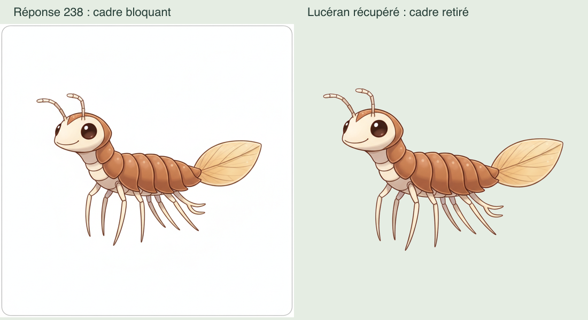
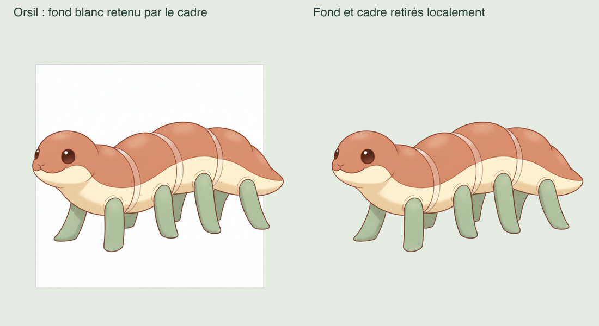

# Monde 0 — détourage récupéré et reprise des évolutions

Le lancement utilisateur `--renewal-0-growth` s’est arrêté au détourage de Lucéran adulte, après six réponses image HTTP 200 (233–238). Bilan conservé : `renewal/0/f1a1962c-b7d2-4893-bc7d-115894c4091c-result.json`, cinq âges sauvegardés, aucune inspection. **238 appels / 16,10 € réservés / plafond autorisé 40 €.**

## Diagnostic et récupération locale

La réponse brute 238 contient un fin cadre gris fermé. Le détourage ne peut atteindre le blanc intérieur : seulement 2,026 % de transparence, sous le minimum existant. Reproduction exacte de l’erreur avant correction. Retrait de la bordure par rectangle intérieur `(32,32,960,960)`, contrôle d’une marge blanche de 2 %, puis détourage habituel : 86,647 % de transparence. Silhouette, visage, antennes et extrémités conservés. Les cinq premières réponses brutes ont été rejouées et comparées exactement aux cinq PNG sauvegardés.



La revue de l’ensemble a révélé un second cadre, dans l’image 235 d’Orsil adulte. Son blanc intérieur restait opaque malgré un détourage considéré valide : la surface extérieure transparente suffisait au seuil. La créature traverse les côtés du cadre ; un recadrage intérieur aurait coupé son corps. Correction locale différente : seuls les pixels gris clairs et neutres du cadre explicitement repéré sont blanchis, puis le détourage habituel est appliqué. Géométrie `(120,135,784,770)`, bande de 6 px ; pixels admissibles `min(R,G,B) ≥ 180` et `max−min ≤ 8`. Les pixels colorés qui traversent les côtés restent intacts. Résultat examiné sur fond vert : 77,666 % transparents, rectangle disparu, contour et marques crème préservés.



Aucun nouveau dessin, aucun appel payant, aucun seuil général modifié. Tous les originaux, traces, brouillons, marqueurs et réservations sont conservés. Les sept bébés approuvés et les dix-huit arts du pilote restent exacts. Ces récupérations techniques ne constituent ni une QA de croissance ni un nouvel accord artistique sur les six adultes.

## Artifacts liés aux sources

Dans `app/data/teddy-world-pilot/` :

- `renewal/0/growth-recovery.json` : empreintes du lancement arrêté, de sa trace et de ses six images brutes ; groupe partiel `renewal/0/growth-recoveries/cf2610c4-8835-485a-bffc-09bc860b2af6-prepared.json`.
- Lucéran dérivé : `world/0/runtime-4ae42d4c-02f6-48c9-95a9-598876bff059-creature-5-adulte.png`.
- `renewal/0/growth-matte-repair.json` : correction supplémentaire d’Orsil liée à la récupération initiale, sans l’écraser. Dérivé `world/0/runtime-065a2aa5-66b9-4488-a7b4-b2660742bf22-creature-2-adulte.png`.
- Galerie courante : [sept bébés et six adultes récupérés](../../../data/teddy-world-pilot/preview-renewal-0-growth-recovered-f1a1962c-b7d2-4893-bc7d-115894c4091c-matte.html). L’ancienne galerie intermédiaire reste conservée.

Le chargeur applique la correction d’Orsil au groupe partiel en mémoire et contrôle toutes les empreintes avant chaque appel. Les autres onze images du groupe partiel restent exactes.

## Commande suivante

Depuis `app/`, dans le Terminal utilisateur avec Node 22 :

```sh
node --conditions=react-server --import tsx scripts/worldgen-pilot.ts --renewal-0-growth-resume
```

Le plan sans API `--renewal-0-growth-resume-plan` a été exécuté sur les vrais fichiers. **Huit images restantes : adulte de Tormille, puis les sept ados. Sept bébés et six adultes réutilisés. Vingt et une inspections, 1,85 € supplémentaires ; cumul prévu 17,95 € sur 40 €.** Prévision globale du socle 0–5 inchangée : 34,95 €, hors autres corrections/finalisation payante. Les deux bases sont ouvertes en lecture seule.

La génération garde les descriptions anatomiques déjà préparées, sans images de référence. Les inspections comparent les trois âges, les autres créatures et le catalogue/pilote ; visage lisible à 128 px toujours obligatoire. Vingt et un verdicts positifs sont nécessaires à la validation complète.

Marqueur séparé `renewal/0/growth-resume-started.json`, nouveaux brouillons de 6 à 14, puis groupe complet ; nouvelle galerie progressive `preview-renewal-0-growth-resume-<run>.html`. Une nouvelle interruption conserve aussi son état et son budget. Ne pas supprimer les marqueurs, ne pas relancer l’ancienne commande `--renewal-0-growth`. Aucun retry, élargissement ou publication automatique. L’accès Gemini de l’agent reste bloqué ; aucun nouvel essai réseau ni contournement.

## Contrôles

22 tests ciblés passent : reproduction des cadres, protection de la silhouette et des marques claires, liaison des fichiers/PNG, absence d’appels si les sources changent, reprise des seuls huit âges avec le budget restant exact, conservation des treize images disponibles et des anciens fichiers, 21 QA, refus visage/croissance, nouvel arrêt et verrou de seconde exécution. Typage, lint et format passent. Plan réel vérifié ; préservation familiale : **26 tables identiques, intégrité ok**.

Aucun seed, migration, remplacement/restauration de base, serveur ou essai familial. Aucun changement de session, possession, surnom, stade, reçu, Teddy ou recalibrage. Les anciens tests, la couverture globale et l’ancien canari restent différés. Suite : compléter puis examiner les trois âges du monde 0, poursuivre les mondes 1–5 autorisés, intégrer le pilote, stabiliser et mettre en service.
