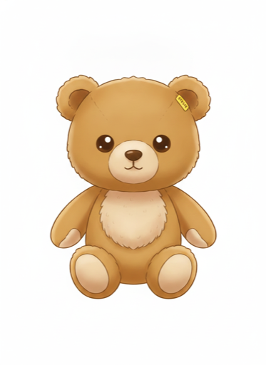
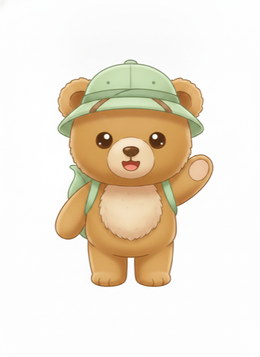
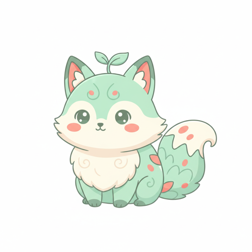

# Spike — Nano Banana (Gemini 2.5 Flash Image) · épic #6

> Validation du modèle d'image **avant** de figer l'abstraction worker/génération (WORLDGEN §5).
> Exécuté le 2026-07-06. Décision : **ADR 0008** (Nano Banana confirmé). Ferme le blocage #146.

## Objectif

WORLDGEN §5 verrouille **Nano Banana (Gemini 2.5 Flash Image)** comme candidat principal,
« à confirmer par spike (qualité kawaii flat-vector / coût / latence / sur-censure) ⚙️ ».
Ce spike répond aux 4 questions avec la **charte de style verrouillée** (ART §5) et les
**vraies photos de Teddy** (`docs/teddy/`, gitignoré).

## Protocole

Appels REST directs `generativelanguage.googleapis.com` (aucune dépendance ajoutée au repo),
clé lue depuis `.env` (jamais loggée). Photos réduites à 1024 px (`sips`) avant envoi.

| # | Test | Entrée | Modèle |
|---|---|---|---|
| A | **Stage A** — master Teddy kawaii | 3 photos réelles + charte ART §5 | `gemini-2.5-flash-image` |
| B | **Stage B** — variante ancrée (consistance) | master (A) + accessoire monde | idem |
| C | **Créature** — cohésion de style pur texte | prompt créature ART §5 | idem |

## Résultats (mesurés)

| Test | Latence | finishReason | Tokens sortie img | Censure |
|---|---|---|---|---|
| A (master) | 12,3 s | STOP | 1290 | aucune |
| B (Stage B) | 9,8 s | STOP | 1290 | aucune |
| C (créature) | 5,8 s | STOP | 1290 | aucune (1× HTTP 500 transitoire, OK au retry) |

Aperçus (thumbnails 512 px) :

| Master (A) | Stage B — explorateur | Créature (C) |
|---|---|---|
|  |  |  |

## Verdict par question

1. **Qualité kawaii flat-vector** — ✅ **excellente**. La charte ART §5 produit exactement
   l'esthétique visée (formes rondes, chibi, grands yeux, pastel, ombrage doux).
2. **Consistance de personnage (Stage A→B)** — ✅ **excellente**. Le killer feature marche :
   ré-ancrer le master en img2img conserve fourrure/visage/proportions à l'identique tout en
   ajoutant l'accessoire du monde. Valide le pipeline 2-stages WORLDGEN §8.
3. **Coût** — ✅ **très bas**. Sortie fixe **1290 tokens/image** → **~0,039 $/image**
   (30 $/M tokens sortie). Un monde ≈ 10-12 images ≈ **~0,45 $/monde**. Le plafond ⚙️
   **~20 €/mois** couvre ~45 mondes uniques/mois — très au-dessus du besoin famille.
4. **Sur-censure** — ✅ **aucune** sur ce périmètre (ours en peluche + créature enfant, tous
   `STOP`). Ne dispense **pas** de la QA kid-safe **de sortie** (WORLDGEN §6, sur le thème généré).

## Frictions → contraintes de build (à câbler dans l'épic #6)

1. **Retry transitoire obligatoire** : 1 appel sur 5 a renvoyé **HTTP 500** (transitoire),
   OK au retry immédiat. Le worker **doit** retenter avec backoff (WORLDGEN §6 « jusqu'à N
   essais ») — 500/503/429 = réessayer, pas échouer.
2. **Texte parasite sur l'étiquette** : au Stage A, l'étiquette d'oreille a rendu un texte
   brouillé (« STESSE ») malgré le negative prompt. Nano Banana **rend du texte** même quand
   on n'en veut pas. **Fix validé** : prompt explicite « small **blank** yellow ear tag, **no
   text/letters** » (Stage B propre). → à intégrer dans les variables de prompt.
3. **Fond blanc, pas d'alpha fiable** : le modèle rend un **fond blanc plein**, pas une vraie
   transparence PNG. ART §5 demande `transparent background` → non honoré de façon fiable.
   Décision de pipeline requise : **détourage/matte en post** OU composer les personnages sur
   **cartes pleines** (pas de compositing sur fond de monde). ⚙️ à trancher story Stage A/B.
4. **Variance de technique d'ombrage** entre mascotte (aérographe doux) et créature (cel-shading
   plus plat). Cohérence de « famille » OK, mais pas rendu pixel-identique. Base prompt
   calibrable ⚙️ (« flat cel shading, clean vector outlines ») — à affiner au playtest.

## Note modèle

Modèles plus récents disponibles sur la clé (`gemini-3-pro-image` alias « Nano Banana Pro »,
`gemini-3.1-flash-image`). `gemini-2.5-flash-image` **nomme déjà la cible** de WORLDGEN §5 et
**atteint la qualité** à **0,039 $/image** → on **confirme 2.5-flash** (choix spec + coût-optimal).
La config (`IMAGE_MODEL` env override, `server-config.ts`) permet de basculer en **1 ligne** si le
besoin qualité monte plus tard — **pas de lock-in**.

## Reproductibilité

Scripts du spike : hors repo (scratchpad, jetables). Prompts = charte **ART §5** (canonique).
Pour reproduire : REST `:generateContent`, `responseModalities:["IMAGE"]`, charte + variables.
